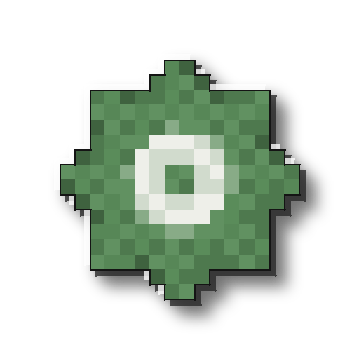
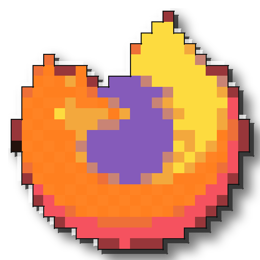
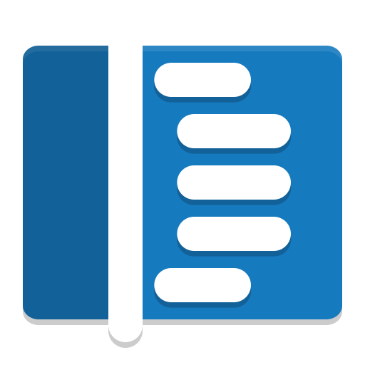
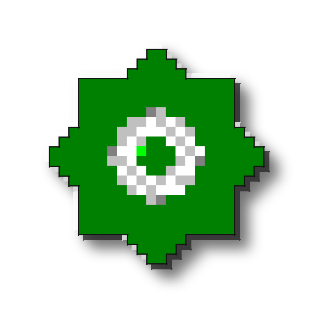
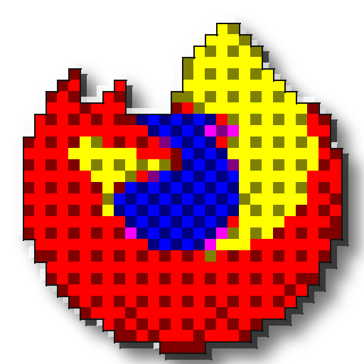
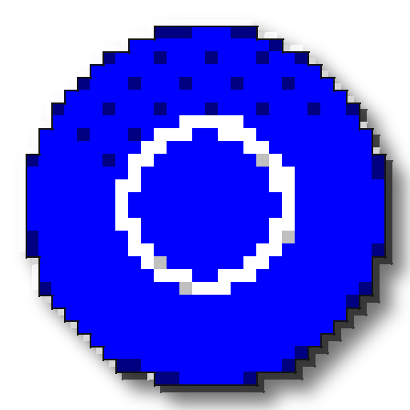
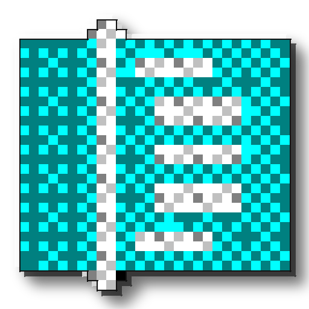

# chunkify95

Recreates a modern app icon in a rough Windows-98-era style: pixel-analyze
the source down to a chunky low-color grid with dithering, trace a black
outline around the silhouette, then layer on a hand-rolled 3D bevel and
hard drop shadow. Those last three things, not just the pixelation, are
what actually make an icon read as "Win98" instead of "photo with a
pixelate filter applied."

| Source | Result | Source | Result |
|---|---|---|---|
|  |  |  |  |
|  |  |  |  |
|  |  | | |

The gear is the original demo asset. The rest come from the
[Papirus icon theme](https://github.com/PapirusDevelopmentTeam/papirus-icon-theme)
(GPL-3.0), specifically its icons for Firefox, Chromium, Steam, and Code -
OSS, the open-source upstream projects, not Google's Chrome or Microsoft's
Visual Studio Code builds. See "Licensing" below for why that distinction
matters.

Built to plug the icon gap in [chicago95-plus](https://github.com/nathanrauf/chicago95-plus)
(a Chicago95-on-Cinnamon companion pack). Chicago95's icon theme covers a
lot, but not everything you actually have installed, and this is the tool
for whatever's left over.

## Usage

```sh
python3 chunkify95.py --input icon.png --output-dir out/
```

Produces `icon-master.png` (512×512) plus `icon-16.png` .. `icon-256.png`
(the standard icon-theme sizes) in `out/`.

Options:

```
--pixel-grid N     downsample grid size before upscaling (default: 24).
                    win95 palette benefits from a higher grid (try 32) to
                    compensate for having only 16 colors to work with.
--colors N         adaptive palette size, ignored unless --palette adaptive (default: 12)
--palette MODE     adaptive (default): best-fit palette per image, keeps
                    real color fidelity. win95: the real fixed 16-color
                    VGA palette, more period-accurate but loses hues with
                    no close match (see below).
--dither-spread N  ordered-dither strength, 0 disables (default: 40)
--no-bevel         skip the 3D bevel pass
--no-shadow        skip the drop shadow
--no-outline       skip the black silhouette outline
--sizes 16,32,48   comma-separated output sizes
```

## Pipeline

1. **Pixel-analyze**: the source is pasted onto a square canvas, downsampled
   to an `N×N` grid with box (area-average) filtering, so each output cell
   is the *dominant* color of its source region rather than a single sampled
   pixel.
2. **Quantize with ordered dithering**: each cell is mapped to the nearest
   color in the palette (adaptive or win95, see `--palette`), after
   perturbing it by a small, position-based threshold (a 4×4 Bayer matrix).
   This produces a deliberate, regular checkerboard exactly at color-
   transition zones instead of either a flat block or scattered noise. See
   "Dithering" below.
3. **Upscale with nearest-neighbor** back to full size, keeping hard pixel
   edges instead of blur.
4. **Outline**: a black line traced around the outer silhouette only (the
   transparent-to-opaque boundary), not between every internal color cell.
5. **Bevel**: a lighter copy of the icon's silhouette offset up-left and a
   darker copy offset down-right, both composited behind the icon,
   approximating the light-top/dark-bottom 3D edge every real Win9x icon
   has.
6. **Drop shadow**: a blurred, offset black copy of the silhouette, behind
   everything.

## Dithering

The first working version of this used `PIL.Image.quantize(...,
dither=Image.FLOYDSTEINBERG)`, and it did nothing. Diffing the output
against `dither=Image.NONE` on the same call showed byte-identical results:
turns out PIL silently ignores the `dither` argument when combined with
`method=Image.MEDIANCUT`. It only takes effect when remapping onto an
*already-built* palette, so building the palette and applying it with
dithering has to be two separate calls.

Fixed that, and Floyd-Steinberg still barely showed up, for a more
fundamental reason: it only dithers where the palette can't represent a
color exactly, and an *adaptive* palette is built to fit the source image,
so there's rarely much to correct. Switching to the actual fixed win95
16-color palette did force dithering, but error-diffusion cascading
through 16 colors produced chaotic per-pixel noise, closer to a scrambled
GIF than a hand-shaded icon.

Ordered (Bayer 4×4) dithering fixed both problems at once. Each pixel's
dither decision depends only on its position in a fixed repeating
threshold pattern, not on accumulated error from previous pixels, so it
produces a *deliberate*, regular checkerboard concentrated at actual color
transitions, closer to how a real pixel artist would hand-place dither for
shading, instead of scattered noise across the whole image.

## Palettes

Windows 95 primarily used a 16-color palette for standard desktop icons
(the OS technically supported up to 256). Using that literal fixed
palette (`--palette win95`) is more historically accurate, but real icons
were hand-drawn by artists choosing which of those colors to use per
region, not automatically quantized against them. Run it automatically on
a modern icon and any hue without a close match in those 16 colors just
degrades: a source purple, with nothing near it in the palette, ends up
flattened to gray. The default `adaptive` palette keeps a source's actual
colors recognizable, which matters more for actually identifying the app
than strict period accuracy does. If you do use `--palette win95`, raise
`--pixel-grid` (32 works well). More spatial resolution gives the dither
pattern more room to carry detail that the smaller palette can't represent
directly.

## Win95 sample

Same five icons, `--palette win95 --pixel-grid 32` instead of the adaptive
default. Compare against the table at the top: more period-accurate colors,
noticeably less vibrant, but still legible thanks to the higher grid
resolution.

    

## Strengths

Simple, high-contrast, single-subject icons: logos, glyphs, app marks. I
tested it against VS Code's and Thunderbird's real icons during development
(not included here, see below) and got genuinely recognizable, distinctly
Win98-flavored results even at 16px.

## Limits

This is a heuristic re-stylization, not true style transfer, and I'd rather
say that up front than let you find out from a muddy result. It will
struggle with:

- **Photographic or gradient-heavy icons**: dithering helps more here than
  flat quantization alone would, but extreme detail still won't survive
  the downsample to a small grid.
- **Icons that are already mostly white/near-transparent**: the alpha
  threshold in the pixelation pass can clip soft edges more aggressively
  than intended.
- **Very detailed/busy icons**: anything with lots of small internal detail
  will lose most of it at low `--pixel-grid` values; raising the grid size
  helps but starts to look less authentically chunky.

If a result looks muddy, try a smaller `--pixel-grid` (more aggressive,
often *more* legible) or fewer `--colors`.

## Licensing

A company's actual logo file is their trademarked artwork, current and
actively enforced. Fine to run this tool against your own desktop's real
icons locally. Not fine to redistribute transformed copies of Google's
Chrome icon or Microsoft's VS Code icon in this repo.

Papirus's icons are a different case: original artwork drawn by the Papirus
project, released under their own GPL-3.0 license, and (where one exists)
drawn for the open-source upstream project rather than the corporate build:
Chromium instead of Chrome, Code - OSS instead of VS Code. Firefox and Steam
don't have that same open/corporate split, so those two are Papirus's own
GPL-licensed renditions of the real apps.

`examples/gear-source.png` is the one fully original placeholder, generated
by `make_example_source.py`. The rasterized Papirus SVGs came from:

```sh
rsvg-convert -w 512 -h 512 /usr/share/icons/Papirus/64x64/apps/firefox.svg -o firefox-source.png
rsvg-convert -w 512 -h 512 /usr/share/icons/Papirus/64x64/apps/chromium.svg -o chromium-source.png
rsvg-convert -w 512 -h 512 /usr/share/icons/Papirus/64x64/apps/steam.svg -o steam-source.png
rsvg-convert -w 512 -h 512 /usr/share/icons/Papirus/64x64/apps/code-oss.svg -o code-oss-source.png
```
