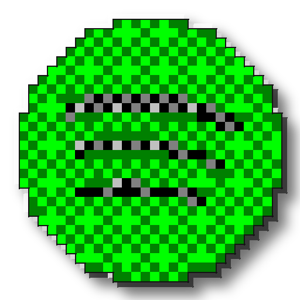

# chunkify95

Recreates a modern app icon in a rough Windows-95/98-era style: pixel-analyze
the source down to a chunky low-color grid with dithering, trace a black
outline around the silhouette, then layer on a hand-rolled 3D bevel and
hard drop shadow.

| Source | Result | Source | Result |
|---|---|---|---|
|  |  |  |  |
|  |  |  |  |
|  |  | | |

Here are some examples. The gear is an original demo asset but the rest come from the
[Papirus icon theme](https://github.com/PapirusDevelopmentTeam/papirus-icon-theme)
(GPL-3.0), specifically its icons for Firefox, Chromium, Steam, and Code -
OSS, the open-source upstream projects, not Google's Chrome or Microsoft's
Visual Studio Code builds. See "Licensing" below.

Built to plug the icon gap in [chicago95-plus](https://github.com/nathanrauf/chicago95-plus)
(a Chicago95-on-Cinnamon companion pack). Chicago95's icon theme covers a
lot, but not everything you actually have installed, and this is the tool
for whatever's left over.

## Usage

```sh
python3 chunkify95.py --input icon.png --output-dir out/
```

Produces `icon-master.png` (512×512) plus `icon-16.png` .. `icon-256.png`
(the standard icon-theme sizes) in `out/`.

Options:

```
--pixel-grid N     downsample grid size before upscaling (default: 24).
                    win95 palette benefits from a higher grid (try 32) to
                    compensate for having only 16 colors to work with.
--colors N         adaptive palette size, ignored unless --palette adaptive (default: 12)
--palette MODE     adaptive (default): best-fit palette per image, keeps
                    real color fidelity. win95: the real fixed 16-color
                    VGA palette, hue-matched (see "Palettes" below),
                    more period-accurate but still fewer colors overall.
--dither-spread N  ordered-dither strength, 0 disables (default: 40
                    adaptive, 250 win95, see "Palettes")
--no-bevel         skip the 3D bevel pass
--no-shadow        skip the drop shadow
--no-outline       skip the black silhouette outline
--sizes 16,32,48   comma-separated output sizes
```

## Pipeline

1. **Pixel-analyze**: the source is pasted onto a square canvas, downsampled
   to an `N×N` grid with box (area-average) filtering, so each output cell
   is the *dominant* color of its source region rather than a single sampled
   pixel.
2. **Quantize with ordered dithering**: each cell is mapped to the nearest
   color in the palette (adaptive or win95, see `--palette`), after
   perturbing it by a small, position-based threshold (a 4×4 Bayer matrix).
   This produces a deliberate, regular checkerboard exactly at color-
   transition zones instead of either a flat block or scattered noise. See
   "Dithering" below.
3. **Upscale with nearest-neighbor** back to full size, keeping hard pixel
   edges instead of blur.
4. **Outline**: a black line traced around the outer silhouette only (the
   transparent-to-opaque boundary), not between every internal color cell.
5. **Bevel**: a lighter copy of the icon's silhouette offset up-left and a
   darker copy offset down-right, both composited behind the icon,
   approximating the light-top/dark-bottom 3D edge every real Win9x icon
   has.
6. **Drop shadow**: a blurred, offset black copy of the silhouette, behind
   everything.

## Dithering

The first working version of this used `PIL.Image.quantize(...,
dither=Image.FLOYDSTEINBERG)`, and it did nothing. Diffing the output
against `dither=Image.NONE` on the same call showed byte-identical results:
turns out PIL silently ignores the `dither` argument when combined with
`method=Image.MEDIANCUT`. It only takes effect when remapping onto an
*already-built* palette, so building the palette and applying it with
dithering has to be two separate calls.

Fixed that, and Floyd-Steinberg still barely showed up, for a more
fundamental reason: it only dithers where the palette can't represent a
color exactly, and an *adaptive* palette is built to fit the source image,
so there's rarely much to correct. Switching to the actual fixed win95
16-color palette did force dithering, but error-diffusion cascading
through 16 colors produced chaotic per-pixel noise, closer to a scrambled
GIF than a hand-shaded icon.

Ordered (Bayer 4×4) dithering fixed both problems at once. Each pixel's
dither decision depends only on its position in a fixed repeating
threshold pattern, not on accumulated error from previous pixels, so it
produces a *deliberate*, regular checkerboard concentrated at actual color
transitions, closer to how a real pixel artist would hand-place dither for
shading, instead of scattered noise across the whole image.

## Palettes

Windows 95 primarily used a 16-color palette for standard desktop icons
(the OS technically supported up to 256). Using that literal fixed
palette (`--palette win95`) is more historically accurate, but real icons
were hand-drawn by artists choosing which of those colors to use per
region, not automatically quantized against them.

Matching each pixel to its nearest palette color by plain RGB distance
mostly defeats the point: gray sits centrally in RGB space, so it reads as
"close" to almost any medium-saturation color regardless of hue. A source
purple with no exact match in the 16 colors would land on gray instead of
purple, red, or blue, even though a person would never call that pixel
gray. `nearest_win95_color` fixes this by treating hue and grayness as
separate questions: pixels below a saturation threshold match among
black/gray/silver/white by brightness only, everything else matches to the
closest *hue family* first, then picks that family's dark or bright variant
by brightness. Two decisions instead of one combined distance, and colors
land on an actually-related hue instead of the desaturated middle color.

Two more win95-specific adjustments came out of testing this against real
icons. The saturation threshold for "count this as gray" started at 0.15
and still let faint anti-aliasing pixels through: a pale green-white edge
blend with sat 0.13 reads as "basically white" to a person but not enough
to clear 0.15, so it fell into the achromatic branch and showed up as stray
gray specks inside otherwise-clean white regions. Raised to 0.22, and those
pixels correctly keep their faint hue instead.

Separately, a flat-shaded region can come out as one solid color with no
texture at all: once a pixel picks "blue family, bright variant," most of
a same-brightness region around it picks the exact same variant, since
there's no gradient pushing any of it toward the dark half. The dither
perturbation needs to be strong enough to actually push some pixels across
that dark/bright boundary, and the default 40 (tuned against the finer-
grained adaptive palette) usually isn't.

The obvious fix, just push the spread way up, caused a new problem at
first: the perturbation was being added to r/g/b before hue was even
computed, so a strong enough push could shift a pixel's hue across a
family boundary entirely, a stray cyan speck showing up in an otherwise
solid blue circle. `nearest_win95_color` now computes hue and saturation
from the true, unperturbed pixel, and only perturbs the brightness used
for the dark/bright decision. Hue is a stable, real property of the
source color; only lightness should be up for dithering.

With that fixed, the remaining question was how much spread it actually
takes to break up a large flat region, and whether a bigger Bayer matrix
would help instead. It doesn't: an 8x8 matrix changes the dither pattern's
micro-texture, not whether a solidly-mid-brightness pixel is anywhere near
the dark/bright threshold in the first place, and a large flat region is
made of exactly those pixels regardless of matrix size. Spread is the
actual lever. Testing it up to 450 against the samples below found no
wrong-hue artifacts anywhere (the hue/brightness split above is what makes
that safe) and no washed-out results even at 300, so `--dither-spread`
defaults to 250 specifically for `--palette win95`. That's what turns the
Chromium icon below, previously close to two flat blue disks, into visible
checkerboard texture across the whole body.

The default `adaptive` palette doesn't need either fix: it's built from the
image's own colors, so nothing in it is competing with gray for pixels that
clearly aren't gray, and its finer-grained palette dithers visibly at the
default spread already. If you do use `--palette win95`, also raise
`--pixel-grid` (32 works well). More spatial resolution gives the dither
pattern more room to carry detail the smaller palette can't represent
directly.

## Win95 sample

Same five icons, `--palette win95 --pixel-grid 32` instead of the adaptive
default. Compare against the table at the top: more period-accurate colors,
still recognizably the right hues now that matching is hue-aware.

    

Flatter, bolder-colored icons hold up even better under the fixed win95
palette, since there's less fine color detail to lose in the first place:

| Source | Result | Source | Result |
|---|---|---|---|
|  |  |  |  |

## Strengths

Simple, high-contrast, single-subject icons: logos, glyphs, app marks. I
tested it against VS Code's and Thunderbird's real icons during development
(not included here, see below) and got genuinely recognizable, distinctly
Win98-flavored results even at 16px.

## Limits

This is a heuristic re-stylization, not true style transfer, and I'd rather
say that up front than let you find out from a muddy result. It will
struggle with:

- **Photographic or gradient-heavy icons**: dithering helps more here than
  flat quantization alone would, but extreme detail still won't survive
  the downsample to a small grid.
- **Icons that are already mostly white/near-transparent**: the alpha
  threshold in the pixelation pass can clip soft edges more aggressively
  than intended.
- **Very detailed/busy icons**: anything with lots of small internal detail
  will lose most of it at low `--pixel-grid` values; raising the grid size
  helps but starts to look less authentically chunky.
- **Single-hue-family icons under `--palette win95`**: hue-family matching
  gives each family exactly two brightness levels to work with, dark and
  bright. An icon that's several shades of one hue to begin with (Chromium's
  blue disk) has nowhere near as much room to look distinct as a multi-hue
  one does; the checkerboard dithering still gives it real texture, but it
  stays visibly a two-tone result. The real 16-color palette also has no
  orange or pink, so an orange source (VLC's cone) hue-matches to yellow,
  the nearest family, not a literal orange.

If a result looks muddy, try a smaller `--pixel-grid` (more aggressive,
often *more* legible) or fewer `--colors`.

## Licensing

A company's actual logo file is their trademarked artwork, current and
actively enforced. Fine to run this tool against your own desktop's real
icons locally. Not fine to redistribute transformed copies of Google's
Chrome icon or Microsoft's VS Code icon in this repo.

Papirus's icons are a different case: original artwork drawn by the Papirus
project, released under their own GPL-3.0 license, and (where one exists)
drawn for the open-source upstream project rather than the corporate build:
Chromium instead of Chrome, Code - OSS instead of VS Code. Firefox, Steam,
Spotify, and Discord don't have that same open/corporate split, so those
are Papirus's own GPL-licensed renditions of the real apps.

`examples/gear-source.png` is the one fully original placeholder, generated
by `make_example_source.py`. The rasterized Papirus SVGs came from:

```sh
rsvg-convert -w 512 -h 512 /usr/share/icons/Papirus/64x64/apps/firefox.svg -o firefox-source.png
rsvg-convert -w 512 -h 512 /usr/share/icons/Papirus/64x64/apps/chromium.svg -o chromium-source.png
rsvg-convert -w 512 -h 512 /usr/share/icons/Papirus/64x64/apps/steam.svg -o steam-source.png
rsvg-convert -w 512 -h 512 /usr/share/icons/Papirus/64x64/apps/code-oss.svg -o code-oss-source.png
rsvg-convert -w 512 -h 512 /usr/share/icons/Papirus/128x128/apps/spotify.svg -o spotify-source.png
rsvg-convert -w 512 -h 512 /usr/share/icons/Papirus/128x128/apps/discord.svg -o discord-source.png
```
